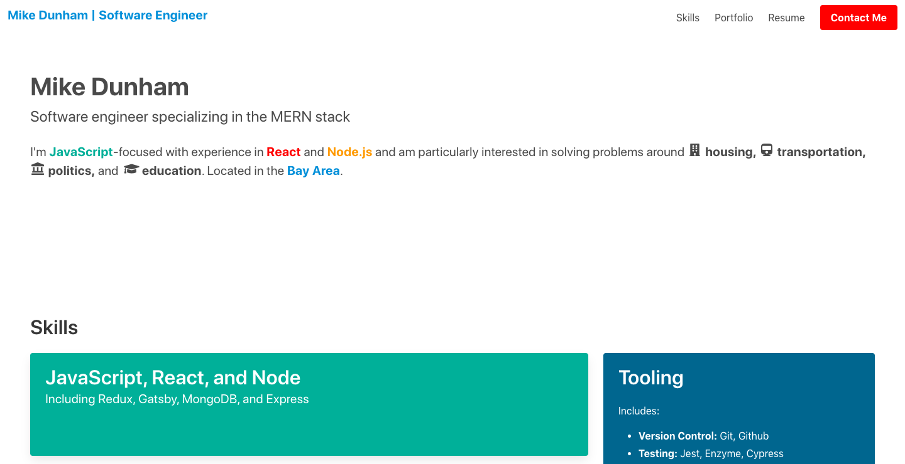

  

<h1 align="center">
  Mike Dunham | Frontend Engineer
</h1>
<h2 align="center">
  Gatsby-based Portfolio Site: <a href="https://www.mikedunham.org" style="text-decoration: none">Click to see it live!</a>
</h2>

  

This is a personal portfolio built on the JAMStack using Gatsby and Netlify. Projects are stored in markdown and can be added, edited, or removed via a NetlifyCMS admin interface, without touching the source code directly.

## Technologies

### Core

  * [JavaScript/React](https://reactjs.org/)
  * [Gatsby](https://www.gatsbyjs.com/)

### User Interface

  * [Bulma](https://bulma.io/)

### Backend / Database

  * [Netlify / NetlifyCMS](https://www.netlify.com/)
  * [GraphQL](https://www.gatsbyjs.org/docs/graphql/)

## Questions?

Feel free to contact Mike at mldunham@gmail.com or visit https://www.mikedunham.org.